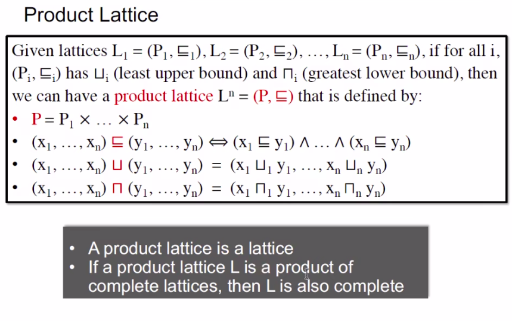

## Static Program Analysis
(静态程序分析)
### Data Flow Analysis — Foundations
#### contents

##### Iterative Algorithm,Another View  

##### Partial Order 

##### Upper and Lower Bounds

##### Lattice,Semi-lattice,Complete And Product Lattice

##### Data Flow Analysis Framework via Lattice

##### Monotonicity and Fixed Point Theorem

*Prove why exist*

*Prove why unique and least*

