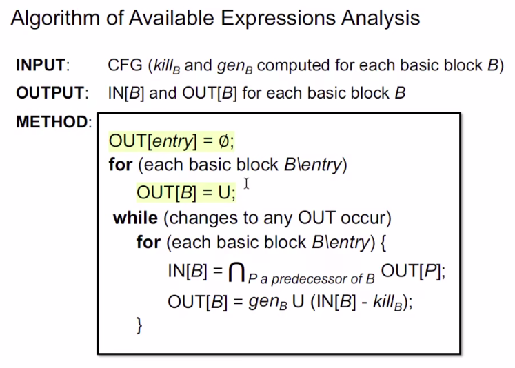

## Static Program Analysis
(静态程序分析)
### Data Flow Analysis
#### contents

##### Data Flow Analysis 
    1. over-approximation改为safe-approximation
    2. may analysis:over
    3. must analysis:under
##### Preliminaries of Data Flow Analysis 

*控制流约束的概念*
##### Data Flow Analysis Applications

*三个例子应用*
###### （1）Reaching Definitions Analysis 

*what is Reaching Definitions Analysis* 

*Understand Reaching Definitions->采用字节码*

**Algorithm*

*Example*
###### （2）Live Variables Analysis 

*what is Live Variables Analysis* 

*Understand Live Variables Analysis* 

**Algorithm*

*Example*
###### （3）Available Expressions Analysis 

*what is Available Expressions Analysis* 

*Understand Available Expressions Analysis* 

**Algorithm*

###### Analysis Comparison

