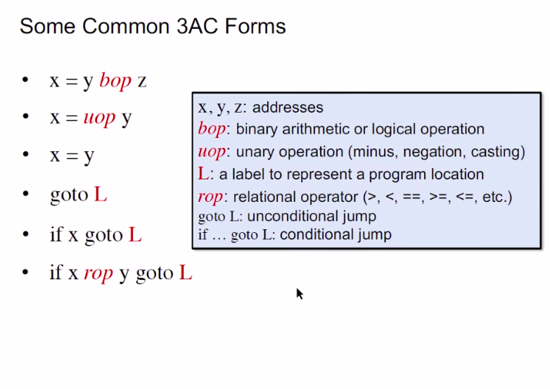
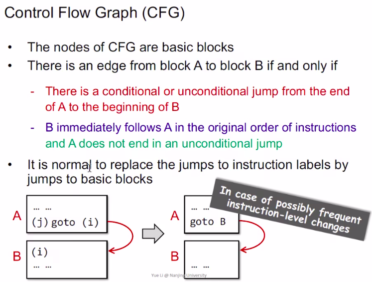

## Static Program analysis
### Intermediate Representation
#### Contents
    1. Compilers and Static Analyzers
    2. AST vs IR
    3. IR: 3VC
    4. 3VC in Real Static Analyzer:Soot
    5. Static Single Assignment(SSA)
    6. Basic Blocks(BB)
    7. Control Flow Graphs(CFG)
##### Compilers and Static Analyzers

##### AST vs IR

##### IR: 3VC

##### 3VC in Real Static Analyzer:Soot

*Java JVM*

*Method Call*

*Method Call*

*Class*
##### Static Single Assignment(SSA) 

|advantage|disadvantage
|---|---|

##### Basic Block (BB) && Control Flow Graphs(CFG)
 
 *Basic Block Algorithm*
 
 *The edges in CFG*
 
 *Add edges in CFG*

    
