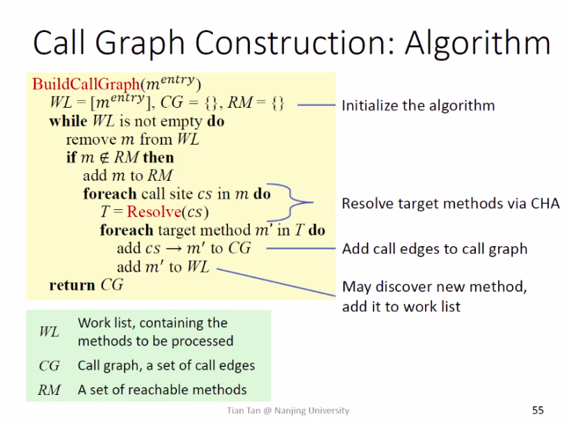

## Static Program Analysis
(静态程序分析)
### Inter procedural Analysis
(过程间分析)
#### Contents
 
##### Motivation
##### Call Graph Construction(CHA) 

*Dispatch Method*

*CHA* 

*Algorithm*

*Example*
##### Inter procedural Control-Flow-Graph 

*Example:Int er procedural Constant Propagation*
Doubt:addOne()调用多次？