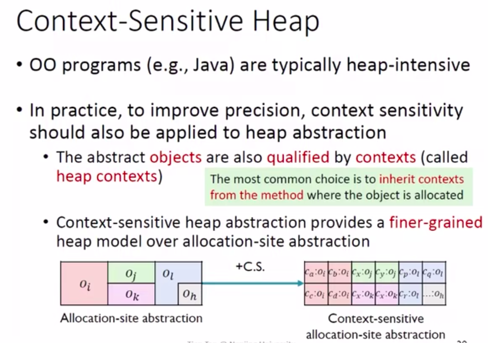

## Static Program Analysis
(静态程序分析)
## Pointer Analysis-Context Sensitivity
### Compare Sensitive with Insensitive

### Contents

#### Introduction

*Imprecision of Context Sensitive*

*Clone实现上下文敏感*

*堆上下文敏感*

*没有使用堆上下文敏感*

*使用堆上下文敏感*
#### Context Sensitive Pointer Analysis:Rules

*Domains and Notations* 
*Assign*
*Store*
*Load*
*Rules*
*Call*
*Example*
Conclusion:上下文不敏感就像你进入一个小黑屋，不记得入口回去的时候可能会走多个入口；上下文敏感就像你进入一个小黑屋，但是记得入口回去的时候走的是来时的入入口，所以会更准确。