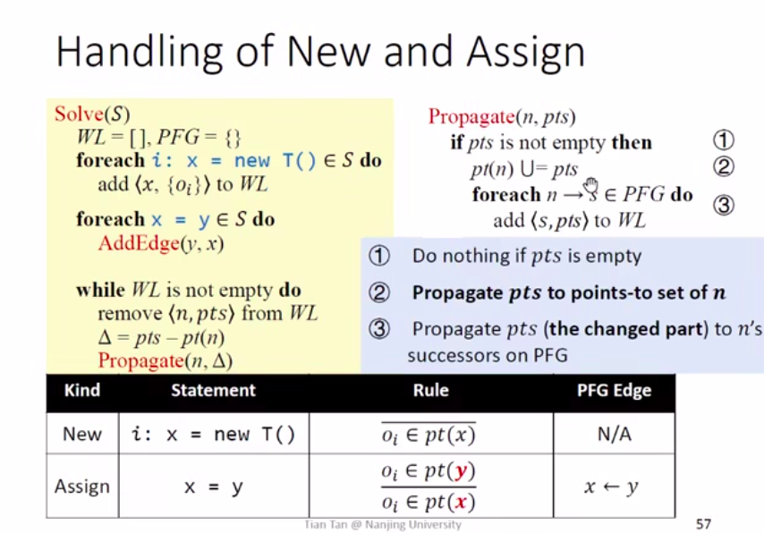
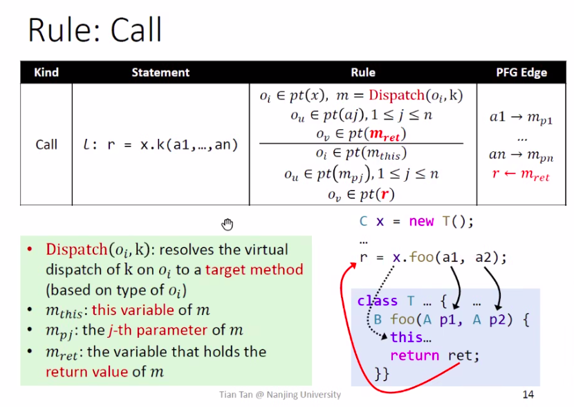

## Static Program Analysis
(静态程序分析)
## Pointer Analysis-Foundation
### Contents

#### Rules

*New*

*Assign*

*Store*

*Load*
#### How to implement Pointer Analysis

*With PFG,pointer analysis can be solved by computing transitive closure of the PFG*

#### Pointer Analysis:Algorithms
##### Handling of New and Assign

*Avoid Redundancy*
##### Handling of Store and Load

##### Review

##### Example

#### Pointer Analysis with Method Calls

*Comparison with CFA* 

*Four Steps*

*Inter procedural Pointer Analysis* 

*Algorithm*

Why do we need to determine whether an edge exists?
决定是否连接边的是oi的类型，之前可能传递过相同类型的对象，L可能会处理多次

