## Static Program Analysis
(静态程序分析)
## Pointer Analysis
### Content
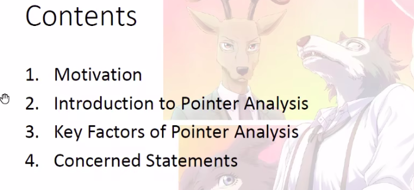
#### Motivation
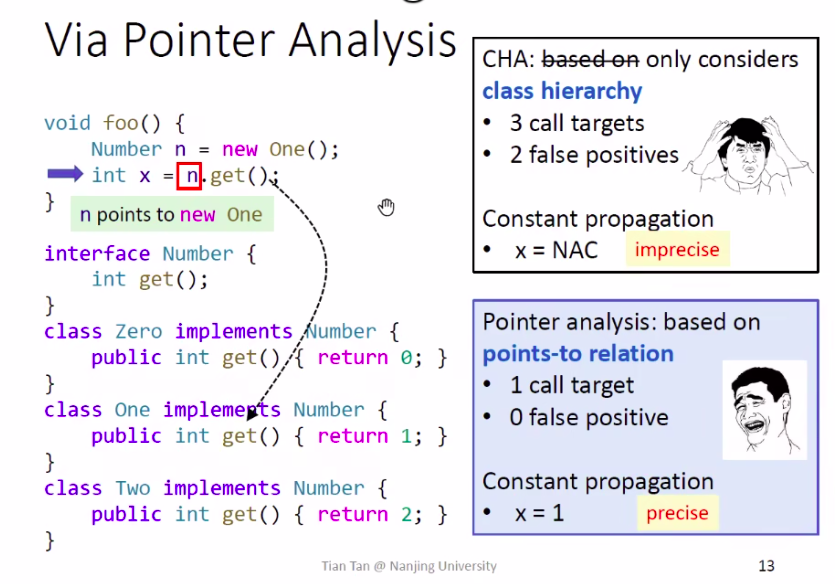
*Compare with CHA*
#### Introduction to Pointer Analysis
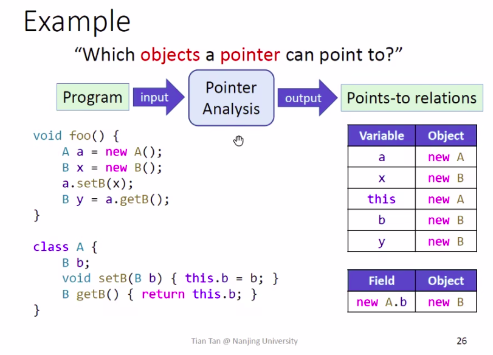
#### Key Factors of Pointer Analysis
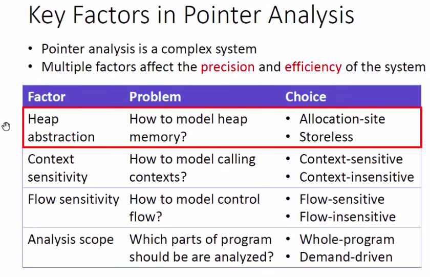
##### Heap Abstraction
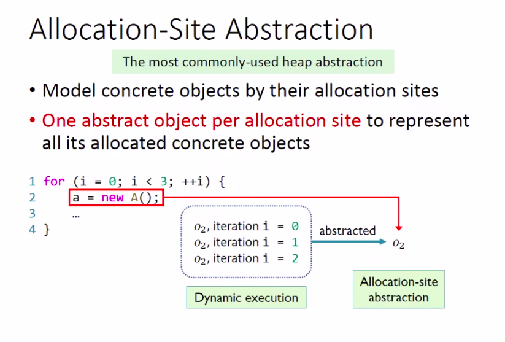
##### Context Sensitivity
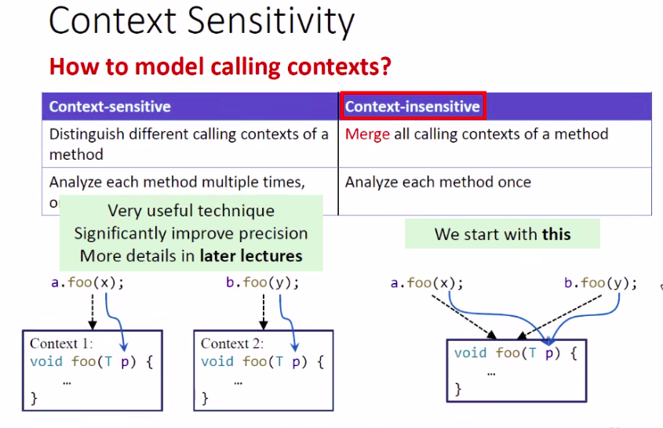
##### Flow Sensitivity
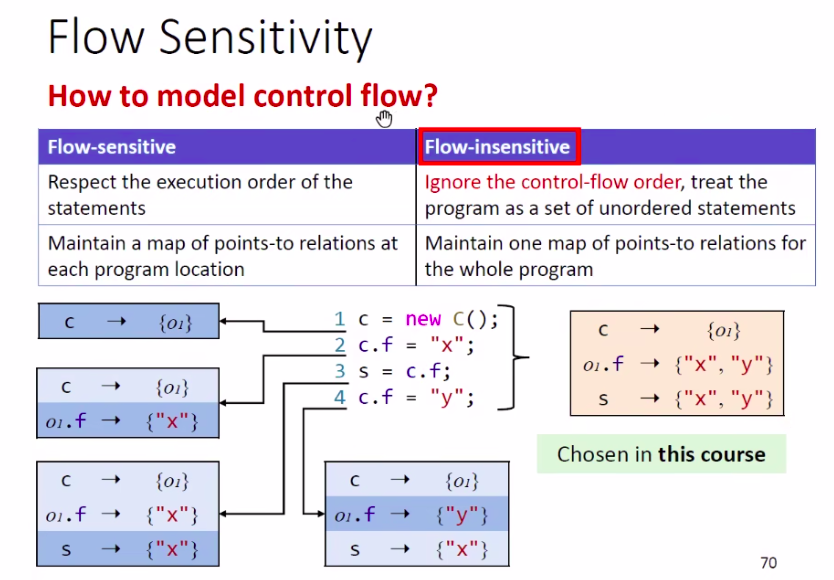
##### Analysis Scope
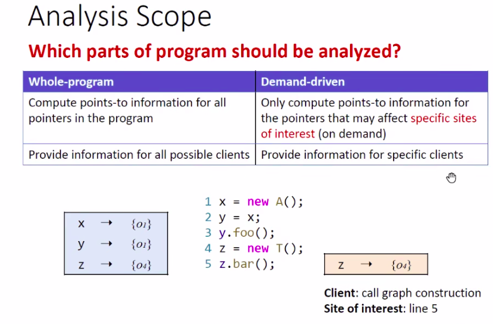
#### Concerned Statements
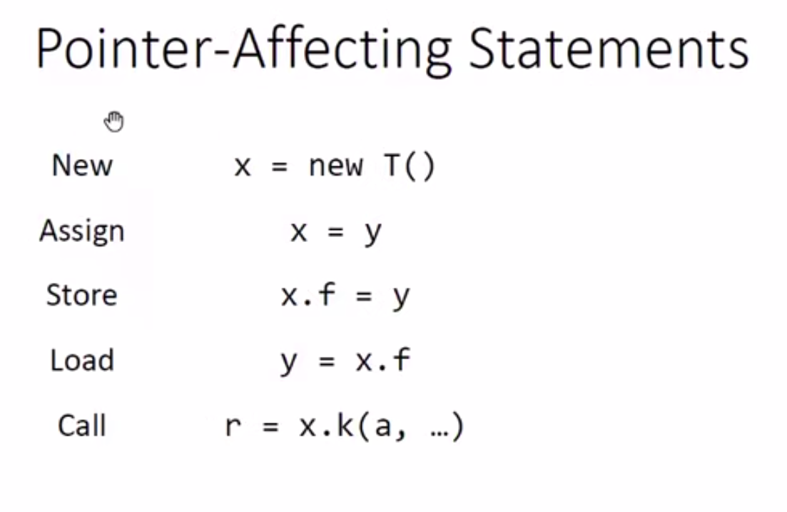
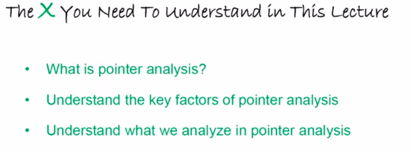
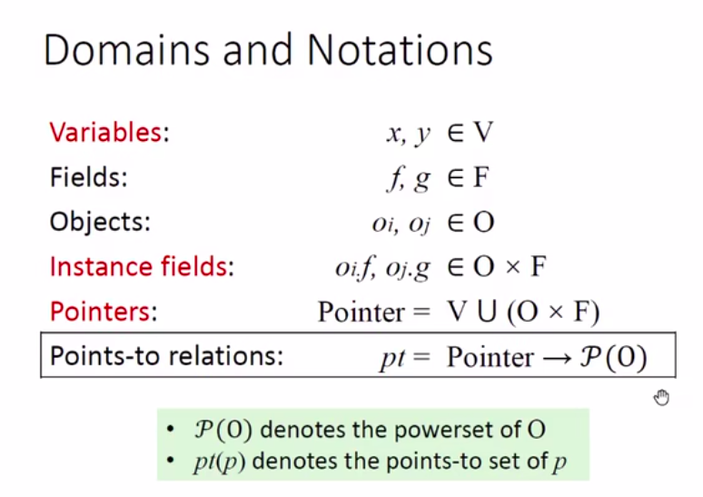
*Domains and Notations*
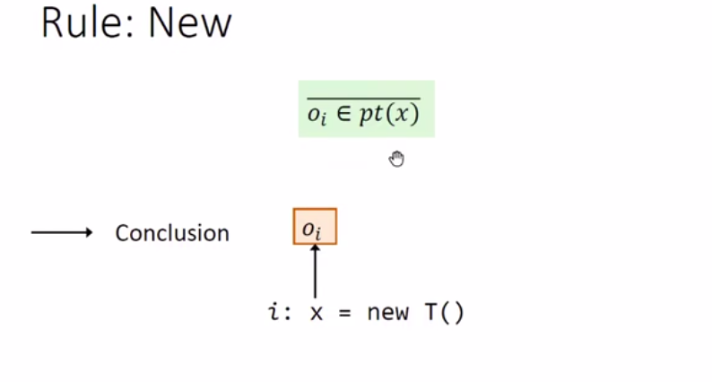
*New*
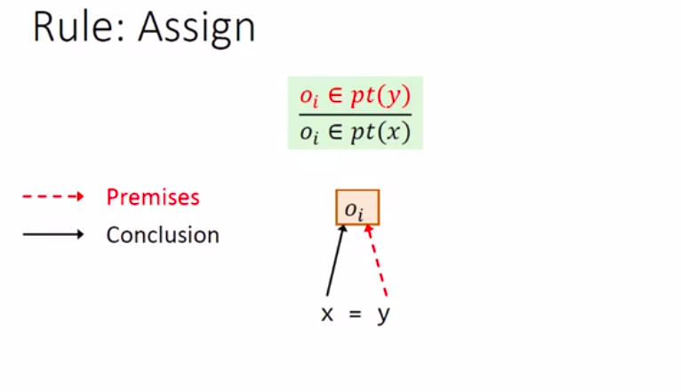
*Assign*
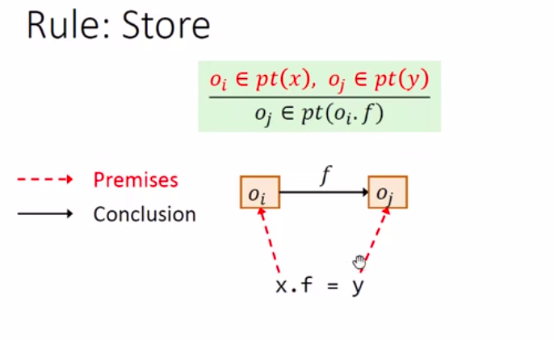
*Store*
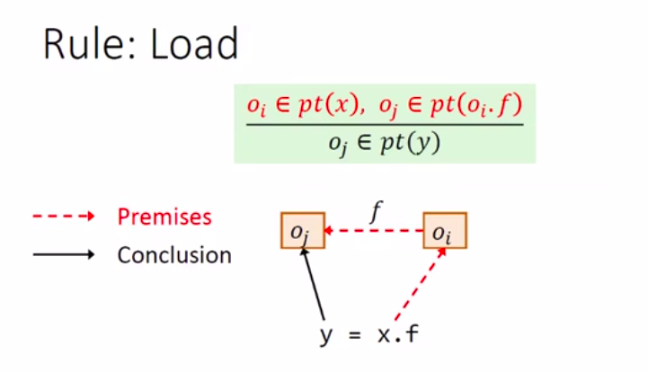
*Load*