## Static Program Analysis
(静态程序分析)
### Static Analysis For Security
#### Contents
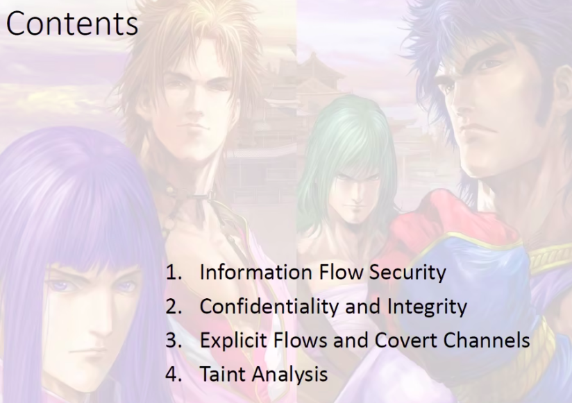
##### Information Flow Security
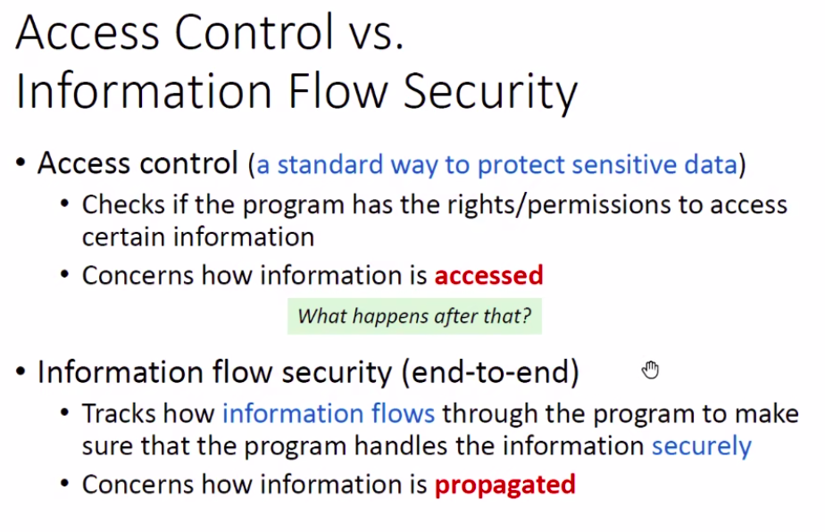
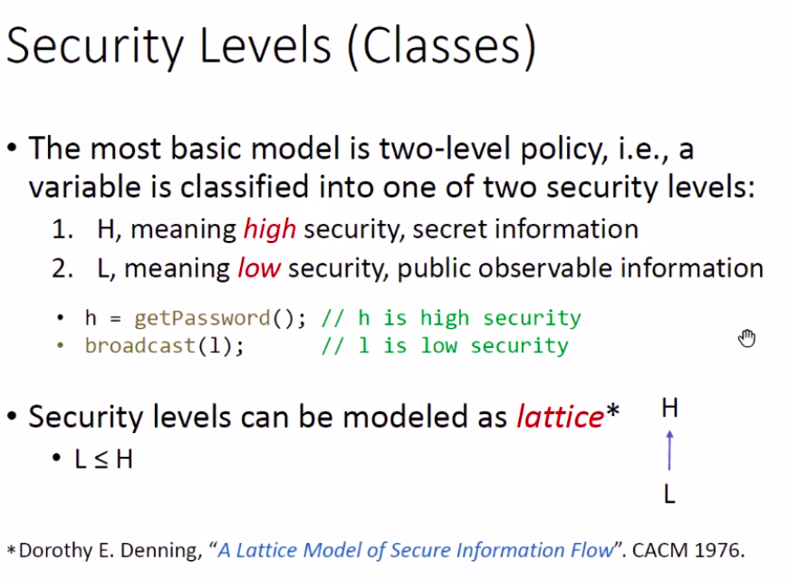
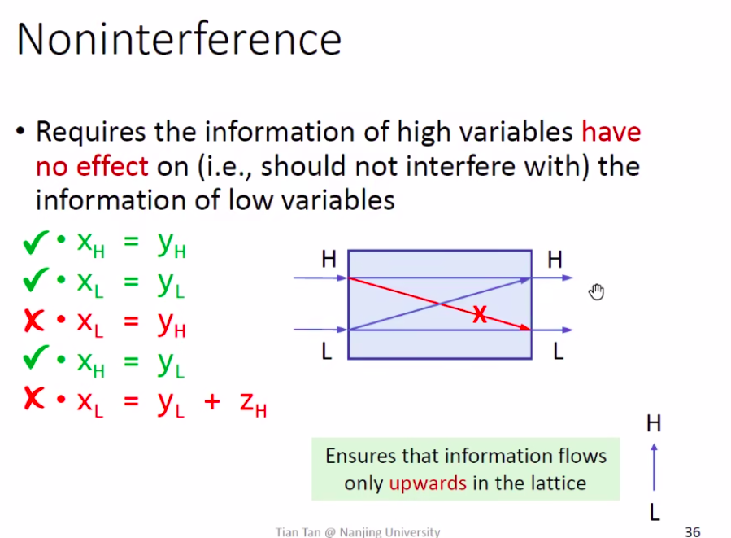
##### Confidentiality And Integrity
note: Confidentiality确保高秘级信息不会流向低秘级信息；Integrity防止低秘级信息污染高秘级信息
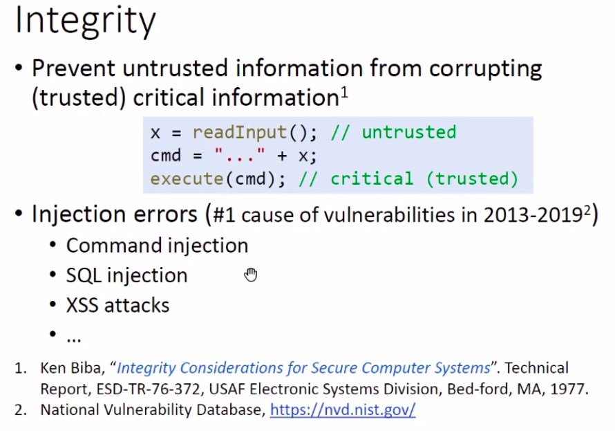
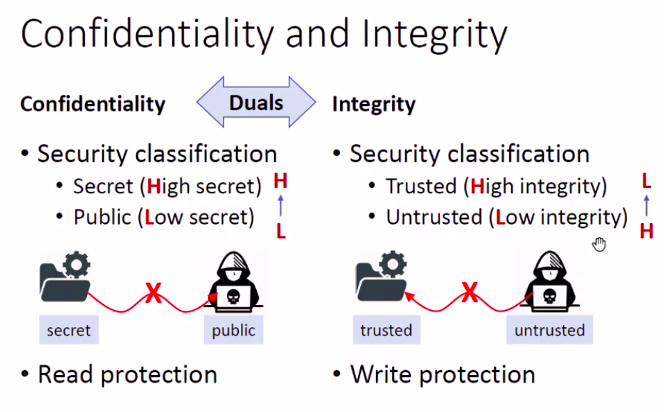
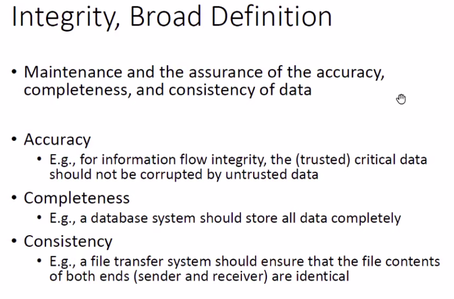 
##### Explicit Flows And Convert Channels 
note:信息流和数据流的区别，信息流涵盖面更广泛
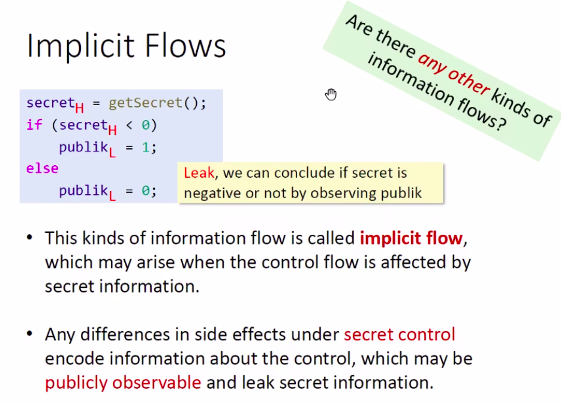
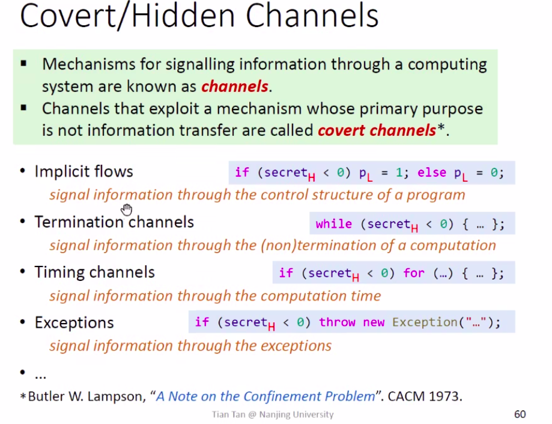
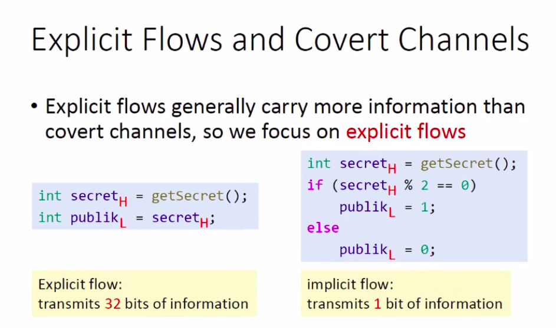
*Explicit Flows危害更大，Covert Channels危害小*
##### Taint Analysis(污点分析)
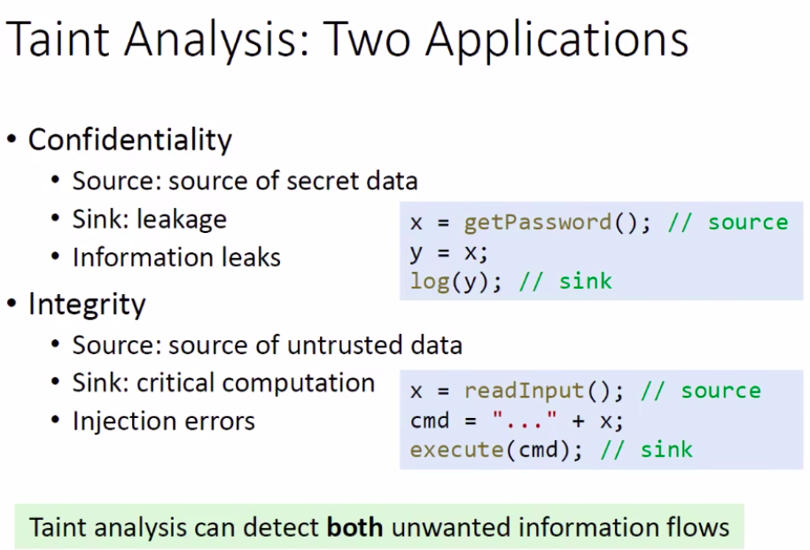
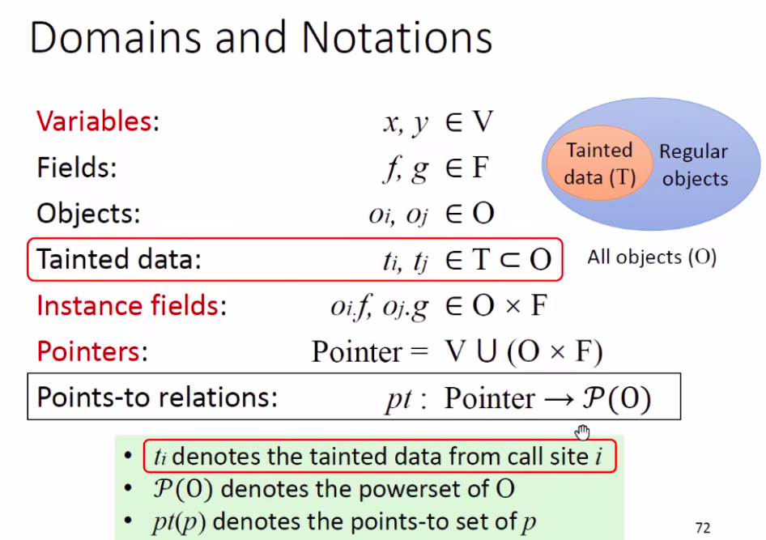
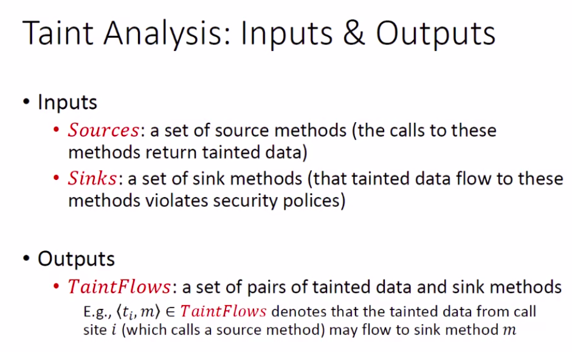
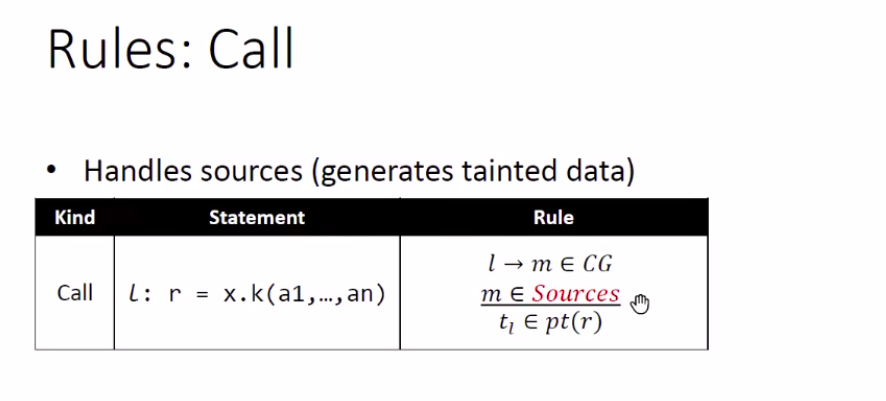
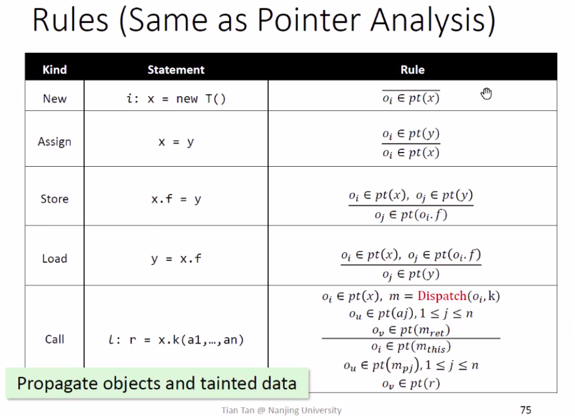
*通过指针分析传播污点数据*
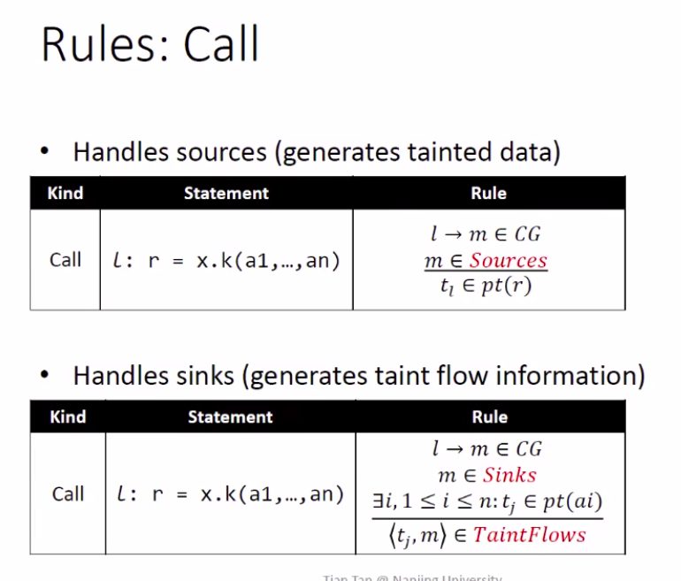
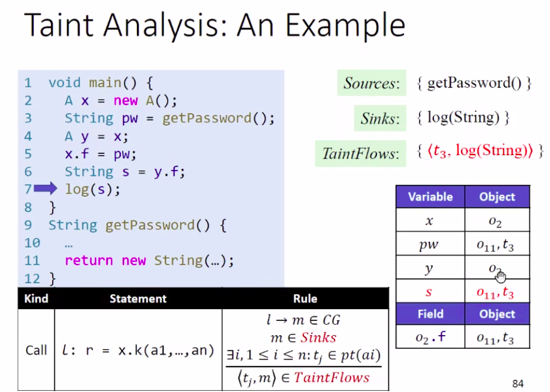
