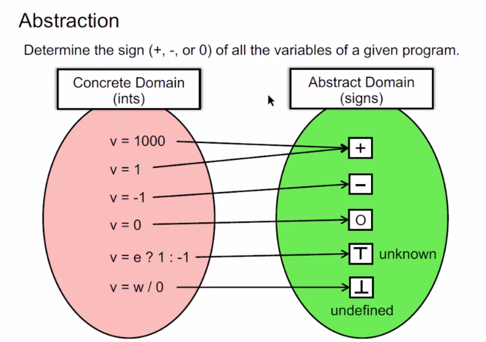

## Static Program Analysis
(静态程序分析)
### Introduction
  1. PL and Static Analysis
        
  2. Why We learn Static Analysis?
        
  3. What is Static Analysis?  
    Rice's Theorem(大米定理):Perfect static analysis isn't exist
    
    
    *sound and complete*

  4. Static Analysis Features and Examples
    Abstraction and over approximation
    
    
  5. Teaching Plan
  6. Evaluation Criteria 
